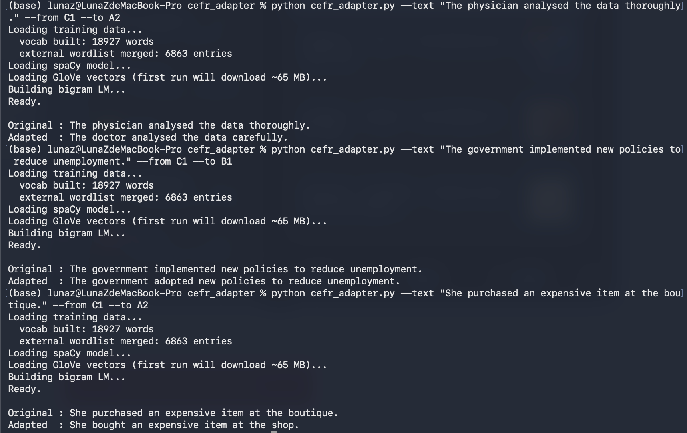

# CEFR Vocabulary Adapter

A command-line NLP tool that rewrites English sentences to match a target CEFR proficiency level. Useful for language learning content, automated text simplification, and ESL material generation.

## Demo



```
$ python cefr_adapter.py --text "The physician analysed the data thoroughly." --from C1 --to A2
Original : The physician analysed the data thoroughly.
Adapted  : The doctor analysed the data carefully.

$ python cefr_adapter.py --text "The government implemented new policies to reduce unemployment." --from C1 --to B1
Original : The government implemented new policies to reduce unemployment.
Adapted  : The government adopted new policies to reduce unemployment.

$ python cefr_adapter.py --text "She purchased an expensive item at the boutique." --from C1 --to A2
Original : She purchased an expensive item at the boutique.
Adapted  : She bought an expensive item at the shop.
```

## How It Works

The pipeline has five stages:

1. **Vocabulary difficulty mapping** — builds a word-to-CEFR-level dictionary from a labelled corpus using relative frequency across levels, merged with the CEFR-J external wordlist for broader coverage
2. **POS tagging** — uses spaCy to identify content words (nouns, verbs, adjectives, adverbs) that are candidates for replacement
3. **Candidate generation** — queries GloVe word vectors for semantically similar words, filtered to the target CEFR level and same part of speech
4. **Fluency ranking** — scores candidates using a bigram language model with Laplace smoothing; picks the word that fits the context most naturally
5. **Inflection matching** — uses pyinflect to match the replacement word's grammatical form to the original (tense, number, etc.)

The tool only replaces words that are more than one CEFR level away from the target, minimising unnecessary changes to the original sentence.

## Installation

```bash
pip install spacy gensim pyinflect pandas
python -m spacy download en_core_web_sm
```

GloVe vectors (~65 MB) are downloaded automatically on first run via gensim.

## Usage

```bash
python cefr_adapter.py --text "Your sentence here." --from <source_level> --to <target_level>
```

Valid levels: `A1` `A2` `B1` `B2` `C1` `C2`

## File Structure

```
cefr_adapter/
├── cefr_adapter.py       # main script
├── data.csv              # labelled training corpus (text, cefr_level)
├── cefr_wordlist.csv     # CEFR-J external wordlist (optional, improves coverage)
└── README.md
```

## Requirements

- Python 3.8+
- `data.csv` — a labelled corpus with `text` and `cefr_level` columns, placed in the same directory
- `cefr_wordlist.csv` — optional; if present, merged automatically on startup ([CEFR-J wordlist](https://github.com/openlanguageprofiles/olp-en-cefrj))

## Limitations

- Relies on GloVe similarity, so rare or domain-specific words may not find good substitutes
- Bigram LM is corpus-dependent; quality improves with a larger and more diverse training set
- Does not rewrite sentence structure, only swaps individual words
- Works best for simplification (higher to lower CEFR level)
